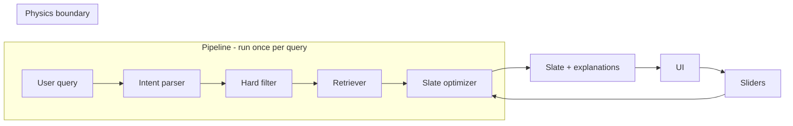

# RecoAgent: Design and physics (learning reference)

This doc explains how RecoAgent is designed, what components it needs, and—in depth—the **quantum-inspired** scoring (the "physics part"). It's a design reference and learning path: conceptual and structural, with no full code—only pseudocode or short snippets where they help.

---

## 1. Overview and high-level architecture

### Purpose of this doc

- **Design reference**: what each component does, what it reads/writes, and how they connect.
- **Learning path**: step-by-step breakdown of the physics (Born rule, interference, slate score) so you can implement and explain it.

### System in one paragraph

The user types a natural-language query. The system **parses** intent (LLM), **filters** the catalog by hard constraints, **retrieves** top-N candidates via embedding similarity, then runs a **slate optimizer** that uses Born-rule relevance and an interference penalty to pick K items. The result is a ranked slate plus per-item match probability and interference. An **explainer** (optional LLM) can polish the "selected because" text. **Sliders** (e.g. diversity strength $\gamma$) re-run only the slate optimizer on the same candidates—no LLM, no new retrieval.

### End-to-end flow (physics boundary)

The **physics boundary** is everything inside the **Slate optimizer**: normalized vectors, Born-rule $r(x)$, interference $I(S)$, and greedy maximization of $J(S)$. The rest of the pipeline (parse, filter, retrieve) prepares the inputs; the slate optimizer produces the slate and the numbers we show in the UI.

---

## 2. Component list (what we need)

| Component | Inputs (from state/config) | Outputs (writes to state) | Responsibility | Depends on | Physics? |
|-----------|----------------------------|---------------------------|----------------|------------|----------|
| **Intent parser** | `user_query` | `parsed_intent`, `parse_valid` | Turn natural language into structured intent, constraints, and optional weight hints. | LLM (e.g. Claude), Pydantic schema | No |
| **Hard filter** | `catalog`, `parsed_intent.constraints` | `filtered_catalog` | Remove items that violate hard constraints (price, integrations, team size). | Catalog schema, constraint definitions | No |
| **Retriever** | `filtered_catalog`, `parsed_intent` (or query embedding) | `candidates` (top-N with embeddings) | Embed query/intent, run similarity search, return top-N candidates with vectors. | Embedding model, ChromaDB (or similar), N | No (embeddings feed physics) |
| **Slate optimizer** | `candidates` (with embeddings), query embedding(s), N, K, $\gamma$, $\beta$ | `slate`, per-item `r(x)`, interference contributions | Compute Born-rule relevance, maximize $J(S)$ via greedy selection, store match prob and interference for UI. | Embeddings, formula for $r$, $I$, $J$ | **Yes** |
| **Explainer** | `slate`, `user_query`, per-item scores | `explanations` (e.g. "selected because") | Generate short human-readable reason per item; optional LLM polish. | Optional LLM; can be deterministic from r(x) + interference | No |
| **UI / Sliders** | User input, current $\gamma$ (and optional $\beta$) | Calls slate optimizer with new $\gamma$/$\beta$ | Let user change diversity strength (and optionally constraint softness); re-run only slate optimizer. | Slate optimizer API | No (triggers physics) |

No code here—just contracts and data flow so you know what each piece must do.

---

## 3. The physics part — learning breakdown

### 3.1 Why "quantum-inspired" (and what we are not doing)

We are **not** using qubits, complex amplitudes, or real quantum hardware. We **are** using three ideas from the Hilbert-space view of quantum mechanics:

1. **State = normalized vector** — The "state" of the query and of each item is a vector (from your embedding model). We treat them like unit vectors in a Hilbert space.
2. **Measurement probability = Born rule** — In QM, the probability of measuring a state in some basis is the squared magnitude of the inner product (Born rule). We use the same formula: relevance = squared inner product between query and item vectors.
3. **Interference = pairwise overlap** — In QM, overlapping states can interfere (cancel or reinforce). Here we use "overlap = redundancy": if two items are very similar, we penalize having both in the slate.

In real quantum mechanics, the Born rule gives the probability of measurement outcomes; interference appears when you add amplitudes. We borrow only the **geometry**: inner products and squared inner products. That gives us a clean way to combine "match to query" (relevance) and "don't be redundant" (diversity) in one objective $J(S)$, with no training data and full explainability.

### 3.2 Vectors and normalization

- **Query** and **each item** are represented by vectors from your embedding model (e.g. sentence-transformers). Typically you embed a string (e.g. structured intent text for the query; name + description + features for each item).
- **Why normalize to unit length:** So that inner products lie in $[-1, 1]$ and squared inner products in $[0, 1]$. That makes $r(x)$ look like a probability and keeps the scale of $J(S)$ under control.
- **What "Hilbert space" means here:** A real vector space with an inner product $\langle \cdot, \cdot \rangle$. We do not need complex numbers for this demo; real embeddings are enough.

So: $\phi$ = unit vector for query, $\psi_x$ = unit vector for item $x$, with $\|\phi\| = 1$ and $\|\psi_x\| = 1$.

### 3.3 Born rule: match probability $r(x)$

**Definition:**
$$r(x) = |\langle \phi, \psi_x \rangle|^2$$

For **real** normalized vectors, $|\langle \phi, \psi_x \rangle|^2$ is just the square of the cosine of the angle between them—i.e. **cosine similarity squared**. So you can implement it as: `cos_sim = dot(phi, psi_x); r_x = cos_sim ** 2`.

**Intuition:** "How much does this item align with the query?" as a number in $[0, 1]$. High $r(x)$ = strong match; low $r(x)$ = weak match.

**Why squared?** In quantum mechanics, probabilities come from squared amplitudes (Born rule). Here we don't have amplitudes—we just use the squared inner product so that the score is non-negative and bounded by 1, and so that small angles (high similarity) get a strong score.

### 3.4 Interference: redundancy penalty $I(S)$

**Definition:**
$$I(S) = \sum_{i < j} |\langle \psi_{x_i}, \psi_{x_j} \rangle|^2$$

Sum over all **pairs** of items in the slate $S$. Each term is the squared inner product between two item vectors.

**Intuition:** If two items are very similar (vectors almost parallel), their inner product is close to 1, so $|\langle \psi_{x_i}, \psi_{x_j} \rangle|^2$ is large. We **penalize** that in $J(S)$ by subtracting $\gamma I(S)$. So high overlap → high $I(S)$ → lower $J(S)$. That pushes the slate toward **diverse** items.

**Why "interference":** In QM, when states overlap, they can interfere. Here we only use the idea that overlap = redundancy: we don't want the slate to contain near-duplicates.

**Example:** If the slate has two nearly identical monitoring tools, their $\langle \psi_{x_i}, \psi_{x_j} \rangle \approx 1$, so that pair contributes about 1 to $I(S)$. Increasing $\gamma$ then strongly penalizes such slates.

### 3.5 Constraint barrier $B(x)$ (optional)

- The **hard filter** still does the real work: items that violate hard constraints (e.g. over budget, missing integration) are removed before retrieval. So in normal operation, every candidate already satisfies hard constraints.
- **Soft barrier** (optional): If you want to allow "slightly over budget" but penalize it instead of hard-cut, you can add:
  $$B(x) = \sum_j \lambda_j \, \max(0, g_j(x))^2$$
  where $g_j(x) \leq 0$ means "satisfies constraint $j$" and $g_j(x) > 0$ means "violates it". So $\max(0, g_j(x))^2$ is zero when satisfied and positive when violated. Then $-\beta \sum_{x \in S} B(x)$ in $J(S)$ penalizes violations.

**When to use:** Only if you want graceful degradation (e.g. "show one slightly over-budget option with a warning"). For a clean demo, hard filter alone is enough.

### 3.6 Slate score $J(S)$ and greedy selection

**Slate score (maximize):**
$$J(S) = \sum_{x \in S} r(x) - \gamma\, I(S) - \beta \sum_{x \in S} B(x)$$

We want to choose a set $S$ of size $K$ that **maximizes** $J(S)$.

**Why greedy:** Enumerating all $\binom{N}{K}$ subsets is expensive. **Greedy selection** is simple and stable: start with $S = \emptyset$; for $k = 1, \ldots, K$, choose the item $x$ (from the remaining candidates) that gives the largest **marginal gain** in $J(S)$ when added to $S$, then add $x$ to $S$. Repeat until $|S| = K$.

**Pseudocode (plain English):**
1. Let `S = []`, `remaining = candidates` (copy).
2. For `k = 1` to `K`:
   - For each `x` in `remaining`, compute `delta_J = J(S ∪ {x}) - J(S)` (marginal gain).
   - Pick `x*` with the largest `delta_J`.
   - Append `x*` to `S`, remove `x*` from `remaining`.
3. Return `S` (order = selection order).

**What to store for the UI:** For each selected item: its $r(x)$, and its **interference added** (the sum of $|\langle \psi_x, \psi_{x_i} \rangle|^2$ over all $x_i$ already in $S$ at the time it was added—i.e. how much redundancy this item introduced).

### 3.7 Optional: mixed-state (multiple query vectors)

When the query is ambiguous (e.g. "cheap but also enterprise-ready"), you can use **multiple intent vectors** $\phi_1, \phi_2, \ldots$ with weights $p_k$ (e.g. from the LLM or from a small set of aspect embeddings):
$$r(x) = \sum_k p_k \, |\langle \phi_k, \psi_x \rangle|^2$$

So relevance is a weighted mix of "match to aspect 1", "match to aspect 2", etc. Single formula; "superposition" vibes without implementing full density matrices. The rest of the pipeline (interference, $J(S)$, greedy) is unchanged.

### 3.8 Defaults and sliders

| Parameter | Typical value | Notes |
|-----------|----------------|--------|
| Candidate pool $N$ (after filter + retrieval) | 30 | Top-N from retriever; slate optimizer chooses K from these. |
| Slate size $K$ | 5 | Number of items to show. |
| Diversity strength $\gamma$ | 0.2–0.6 | Slider: higher = more penalty for redundancy. |
| Constraint softness $\beta$ | 0 or fixed | Optional; use only if you add soft barrier $B(x)$. |

**What the sliders control:** $\gamma$ (diversity strength) is the main one; optionally $\beta$ if you use soft constraints. When the user moves a slider, the app **re-runs only the slate optimizer** on the same candidates with the new $\gamma$ (and $\beta$). No LLM call, no new retrieval—so the ranking updates in real time. That's the "sliders are the product" idea.

---

## 4. Data and state (what flows where)

**RecoState (conceptual):**

| Field | Set by | Consumed by |
|-------|--------|-------------|
| `user_query` | UI | Intent parser |
| `parsed_intent` | Intent parser | Hard filter, Retriever, Slate optimizer (for query embedding) |
| `parse_valid` | Intent parser | Graph routing |
| `filtered_catalog` | Hard filter | Retriever |
| `candidates` | Retriever | Slate optimizer |
| `slate` | Slate optimizer | Explainer, UI |
| Per-item: `r(x)`, interference contribution | Slate optimizer | Explainer, UI |
| `explanations` | Explainer | UI |

**What the Slate Optimizer needs at call time:**

- Candidate list with embeddings (e.g. list of `{id, embedding, ...}`).
- Query embedding $\phi$ (or multiple $\phi_k$ + weights $p_k$ for mixed-state).
- Parameters: $N$ (already implied by candidate list size), $K$, $\gamma$, $\beta$ (if using $B(x)$).

It returns: ordered slate of $K$ items, and for each item: $r(x)$ and interference added (and optionally the full $J(S)$ and $I(S)$ for debugging).

---

## 5. UI and explainability

**What the UI shows for each recommended item:**

- **Match probability** = $r(x)$ (the Born-rule score).
- **Interference added** = how much this item increased $I(S)$ when it was added (redundancy vs already-selected items).
- **Selected because** = short text, e.g. "High match to your intent (0.82), low overlap with other picks." Can be generated deterministically from $r(x)$ and interference; the Explainer component can add optional LLM polish for natural language.

**Where "selected because" comes from:** Deterministic: we have $r(x)$ and the interference contribution. You can template it: "Match probability {r(x):.2f}; interference added {interference:.2f}." Optional: pass the same numbers to an LLM to produce a friendlier one-line explanation.

---

## 6. Implementation checklist (no code, just order)

1. **State and config** — Define RecoState (TypedDict or Pydantic), and config for domain (N, K, $\gamma$, embedding model, catalog path).
2. **Embeddings + retriever** — Build embeddings for catalog items; embed query/intent; implement retrieval (e.g. ChromaDB) to return top-N candidates with vectors. Normalize vectors.
3. **Hard filter** — Implement constraint checks (price, integrations, team size) and filter catalog before retrieval.
4. **Born-rule $r(x)$ and interference $I(S)$** — Functions: given $\phi$ and $\psi_x$, return $r(x)$; given a set of item vectors, return $I(S)$ and per-pair contributions.
5. **Greedy slate builder** — Given candidates (with embeddings), $\phi$, K, $\gamma$, $\beta$: compute $r(x)$ for all, then greedy selection to maximize $J(S)$. Return slate and per-item $r(x)$ + interference added.
6. **Sliders + re-optimize** — UI sliders for $\gamma$ (and optional $\beta$). On change, call slate optimizer again with same candidates; update displayed slate and scores.
7. **Intent parser + Explainer** — Parser: LLM → structured intent (and optionally query embedding or aspect weights). Explainer: optional LLM or template to generate "selected because" from $r(x)$ and interference.
8. **Eval** — Test queries, expected slates or constraints, and metrics (e.g. precision@K, constraint satisfaction, ranking stability).

---

## 7. References and further reading

- **Born rule:** [Wikipedia — Born rule](https://en.wikipedia.org/wiki/Born_rule) — probability of measurement outcomes as squared amplitude.
- **Hilbert space:** [Wikipedia — Hilbert space](https://en.wikipedia.org/wiki/Hilbert_space) — inner product spaces; we use the real, finite-dimensional case.

No need to go deeper for this project; the doc above is enough to implement and explain the physics part.
